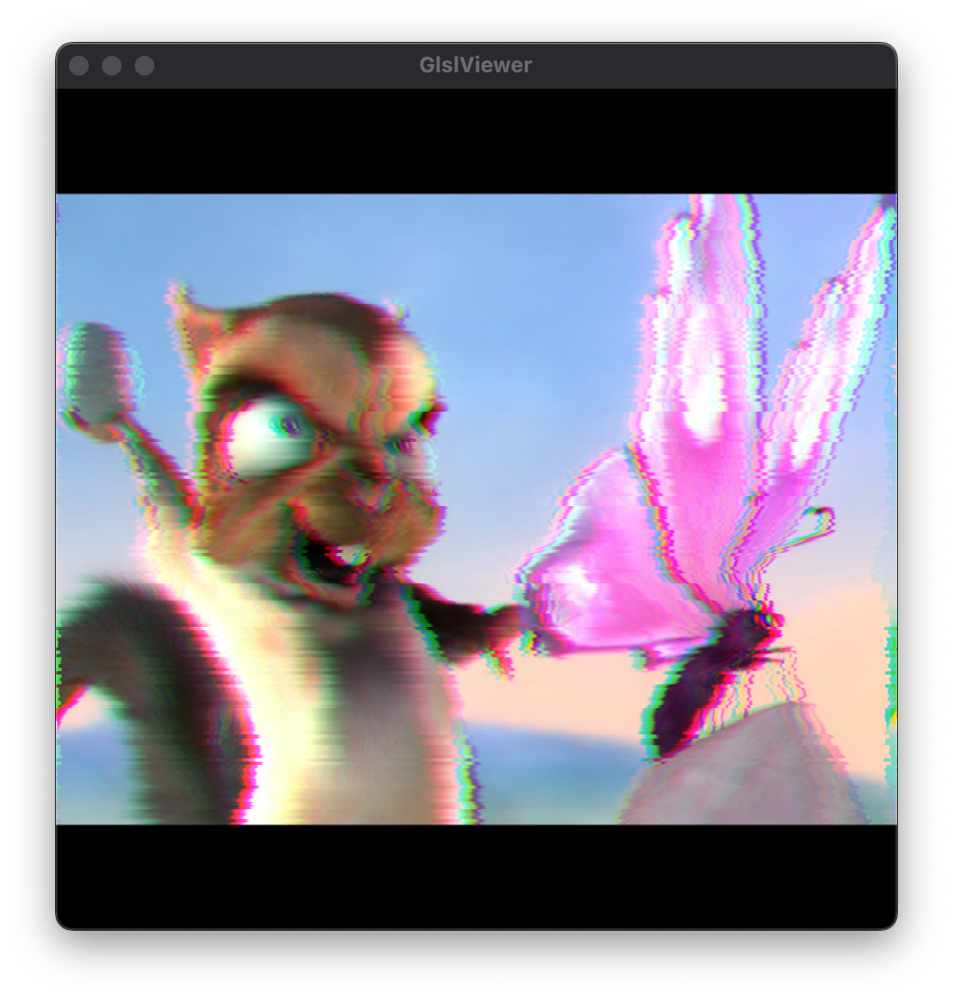

These are some experiments with video-processing in shaders for my friend Tim.

These will run in [glslViewer](https://github.com/patriciogonzalezvivo/glslViewer) on a pi or whatever, and can take input video.

run them like this:

```
glslViewer --life-coding 0-basic.frag https://www.sample-videos.com/video123/mp4/480/big_buck_bunny_480p_30mb.mp4
```

You can also use any video file in place of the test URL:

```
glslViewer --life-coding 0-basic.frag YOURVIDEOFILE
```

You can do similar with video-input device 0:

```
glslViewer --life-coding -video 0 0-basic.frag
```

There is also a `--fullscreen` and `-w/-h` options to set the size. Use `--help` for more options.


This is live-coding, so you can edit & save any shader to update what it shows.


